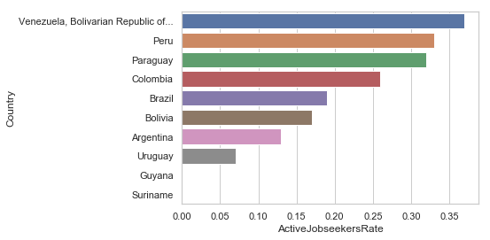
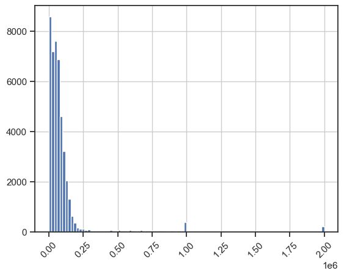
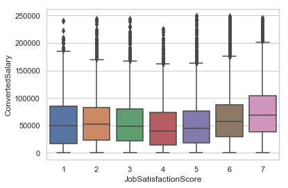
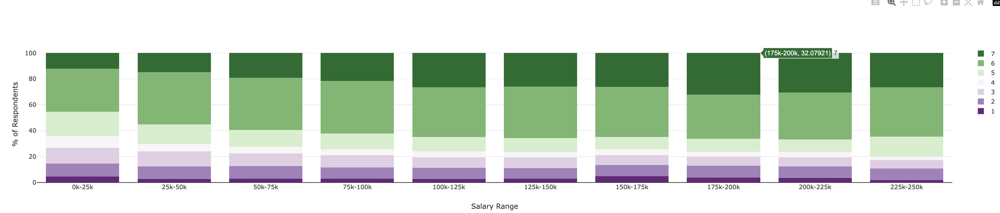

# Insights from 2018 Stackoverflow developer survey 


```python
import pandas as pd
import numpy as np
import seaborn as sns
import matplotlib.pyplot as plt
sns.set(style="ticks")
import copy
from scipy import stats

import plotly
import plotly.graph_objs as go

plotly.offline.init_notebook_mode(connected=True)
```


<script>requirejs.config({paths: { 'plotly': ['https://cdn.plot.ly/plotly-latest.min']},});if(!window.Plotly) {{require(['plotly'],function(plotly) {window.Plotly=plotly;});}}</script>


## Load data

1. Load the public survey results dataset from 2018
2. Parse data and attribute a developer role using the following criteria:
    - When "developer" is in the DevType column, it is considered a developer, otherwise it's not one. For example: 
      - For "Engineering manager" we set `IsDeveloper = false`
      - For "Front-end developer" we set `IsDeveloper = true`


```python
data = pd.read_csv("survey_results_public.csv", low_memory=False)
data['IsDeveloper'] = data.DevType.str.contains('developer')
data.head()
```


<div>
<style scoped>
    .dataframe tbody tr th:only-of-type {
        vertical-align: middle;
    }

    .dataframe tbody tr th {
        vertical-align: top;
    }

    .dataframe thead th {
        text-align: right;
    }
</style>
<table border="1" class="dataframe">
  <thead>
    <tr style="text-align: right;">
      <th></th>
      <th>Respondent</th>
      <th>Hobby</th>
      <th>OpenSource</th>
      <th>Country</th>
      <th>Student</th>
      <th>Employment</th>
      <th>FormalEducation</th>
      <th>UndergradMajor</th>
      <th>CompanySize</th>
      <th>DevType</th>
      <th>...</th>
      <th>Gender</th>
      <th>SexualOrientation</th>
      <th>EducationParents</th>
      <th>RaceEthnicity</th>
      <th>Age</th>
      <th>Dependents</th>
      <th>MilitaryUS</th>
      <th>SurveyTooLong</th>
      <th>SurveyEasy</th>
      <th>IsDeveloper</th>
    </tr>
  </thead>
  <tbody>
    <tr>
      <th>0</th>
      <td>1</td>
      <td>Yes</td>
      <td>No</td>
      <td>Kenya</td>
      <td>No</td>
      <td>Employed part-time</td>
      <td>Bachelor’s degree (BA, BS, B.Eng., etc.)</td>
      <td>Mathematics or statistics</td>
      <td>20 to 99 employees</td>
      <td>Full-stack developer</td>
      <td>...</td>
      <td>Male</td>
      <td>Straight or heterosexual</td>
      <td>Bachelor’s degree (BA, BS, B.Eng., etc.)</td>
      <td>Black or of African descent</td>
      <td>25 - 34 years old</td>
      <td>Yes</td>
      <td>NaN</td>
      <td>The survey was an appropriate length</td>
      <td>Very easy</td>
      <td>True</td>
    </tr>
    <tr>
      <th>1</th>
      <td>3</td>
      <td>Yes</td>
      <td>Yes</td>
      <td>United Kingdom</td>
      <td>No</td>
      <td>Employed full-time</td>
      <td>Bachelor’s degree (BA, BS, B.Eng., etc.)</td>
      <td>A natural science (ex. biology, chemistry, phy...</td>
      <td>10,000 or more employees</td>
      <td>Database administrator;DevOps specialist;Full-...</td>
      <td>...</td>
      <td>Male</td>
      <td>Straight or heterosexual</td>
      <td>Bachelor’s degree (BA, BS, B.Eng., etc.)</td>
      <td>White or of European descent</td>
      <td>35 - 44 years old</td>
      <td>Yes</td>
      <td>NaN</td>
      <td>The survey was an appropriate length</td>
      <td>Somewhat easy</td>
      <td>True</td>
    </tr>
    <tr>
      <th>2</th>
      <td>4</td>
      <td>Yes</td>
      <td>Yes</td>
      <td>United States</td>
      <td>No</td>
      <td>Employed full-time</td>
      <td>Associate degree</td>
      <td>Computer science, computer engineering, or sof...</td>
      <td>20 to 99 employees</td>
      <td>Engineering manager;Full-stack developer</td>
      <td>...</td>
      <td>NaN</td>
      <td>NaN</td>
      <td>NaN</td>
      <td>NaN</td>
      <td>NaN</td>
      <td>NaN</td>
      <td>NaN</td>
      <td>NaN</td>
      <td>NaN</td>
      <td>True</td>
    </tr>
    <tr>
      <th>3</th>
      <td>5</td>
      <td>No</td>
      <td>No</td>
      <td>United States</td>
      <td>No</td>
      <td>Employed full-time</td>
      <td>Bachelor’s degree (BA, BS, B.Eng., etc.)</td>
      <td>Computer science, computer engineering, or sof...</td>
      <td>100 to 499 employees</td>
      <td>Full-stack developer</td>
      <td>...</td>
      <td>Male</td>
      <td>Straight or heterosexual</td>
      <td>Some college/university study without earning ...</td>
      <td>White or of European descent</td>
      <td>35 - 44 years old</td>
      <td>No</td>
      <td>No</td>
      <td>The survey was an appropriate length</td>
      <td>Somewhat easy</td>
      <td>True</td>
    </tr>
    <tr>
      <th>4</th>
      <td>7</td>
      <td>Yes</td>
      <td>No</td>
      <td>South Africa</td>
      <td>Yes, part-time</td>
      <td>Employed full-time</td>
      <td>Some college/university study without earning ...</td>
      <td>Computer science, computer engineering, or sof...</td>
      <td>10,000 or more employees</td>
      <td>Data or business analyst;Desktop or enterprise...</td>
      <td>...</td>
      <td>Male</td>
      <td>Straight or heterosexual</td>
      <td>Some college/university study without earning ...</td>
      <td>White or of European descent</td>
      <td>18 - 24 years old</td>
      <td>Yes</td>
      <td>NaN</td>
      <td>The survey was an appropriate length</td>
      <td>Somewhat easy</td>
      <td>True</td>
    </tr>
  </tbody>
</table>
<p>5 rows × 130 columns</p>
</div>


## Extract insights

The goal of this analysis is to extract general insights from this dataset. In the next sections, we explore the survey results to answer the following business questions:

#### Turn-over factors
    - Are developers predominantly active job seekers or not? 

#### Impact of programming language
    - Are functional language developers happier than non-functional ones?

#### Compensation x Satisfaction
    - What is the salary level after which money doesn't make a difference in terms of job satisfaction? 

#### Wellness 
    - Do developers who exercise are happier and more productive than developers who don’t exercise?

### Q1. Are Latin American developers predominantly active job seekers or not? 
We restricted the analysis to the following countries: Brazil, Argentina, Uruguay, Paraguay, Bolivia, Peru, Colombia, Venezuela, Bolivia, Suriname, Guyana, French Guiana


```python
countries = ['Brazil','Argentina','Uruguay','Paraguay','Bolivia','Peru','Colombia', 
             'Venezuela, Bolivarian Republic of...','Suriname','Guyana','French Guiana']

```


```python
# Getting total developers, total active job seekers and active job seekers rate for each country.
data_country = data[((data.IsDeveloper == True) &
                    (data.Country.isin(countries)) & 
                    (data.JobSearchStatus.notnull()))]

total = data_country.Country.value_counts()
total = total.rename_axis('Country').reset_index(name='TotalDevelopers')

active_jobseekers = data_country[data_country.JobSearchStatus == 'I am actively looking for a job'].Country.value_counts()
active_jobseekers = active_jobseekers.rename_axis('Country').reset_index(name='ActiveJobseekers')

result = pd.merge(total, active_jobseekers,on='Country', how='outer').fillna(0)
result['ActiveJobseekersRate'] = round(result.ActiveJobseekers / result.TotalDevelopers,2)
result = result.sort_values('ActiveJobseekersRate', ascending=False)
result 
```


<div>
<style scoped>
    .dataframe tbody tr th:only-of-type {
        vertical-align: middle;
    }

    .dataframe tbody tr th {
        vertical-align: top;
    }

    .dataframe thead th {
        text-align: right;
    }
</style>
<table border="1" class="dataframe">
  <thead>
    <tr style="text-align: right;">
      <th></th>
      <th>Country</th>
      <th>TotalDevelopers</th>
      <th>ActiveJobseekers</th>
      <th>ActiveJobseekersRate</th>
    </tr>
  </thead>
  <tbody>
    <tr>
      <th>3</th>
      <td>Venezuela, Bolivarian Republic of...</td>
      <td>93</td>
      <td>34.0</td>
      <td>0.37</td>
    </tr>
    <tr>
      <th>4</th>
      <td>Peru</td>
      <td>83</td>
      <td>27.0</td>
      <td>0.33</td>
    </tr>
    <tr>
      <th>6</th>
      <td>Paraguay</td>
      <td>37</td>
      <td>12.0</td>
      <td>0.32</td>
    </tr>
    <tr>
      <th>2</th>
      <td>Colombia</td>
      <td>260</td>
      <td>68.0</td>
      <td>0.26</td>
    </tr>
    <tr>
      <th>0</th>
      <td>Brazil</td>
      <td>1829</td>
      <td>339.0</td>
      <td>0.19</td>
    </tr>
    <tr>
      <th>7</th>
      <td>Bolivia</td>
      <td>29</td>
      <td>5.0</td>
      <td>0.17</td>
    </tr>
    <tr>
      <th>1</th>
      <td>Argentina</td>
      <td>468</td>
      <td>59.0</td>
      <td>0.13</td>
    </tr>
    <tr>
      <th>5</th>
      <td>Uruguay</td>
      <td>75</td>
      <td>5.0</td>
      <td>0.07</td>
    </tr>
    <tr>
      <th>8</th>
      <td>Guyana</td>
      <td>2</td>
      <td>0.0</td>
      <td>0.00</td>
    </tr>
    <tr>
      <th>9</th>
      <td>Suriname</td>
      <td>1</td>
      <td>0.0</td>
      <td>0.00</td>
    </tr>
  </tbody>
</table>
</div>


```python
sns.set(style="whitegrid")
ax = sns.barplot(x="ActiveJobseekersRate", y="Country", data=result)
plt.show()
```


    

    


It seems Latin developers are not predominantly active job seekers. The Top5 rank by country suggests the following distribution:
- Peru (33%)
- Paraguay (32%)
- Colombia (26%)
- Brazil (19%)
- Argentina (15%)

Mostly of the developers for these country are NOT actively looking for new jobs. Are they satisfied with their current jobs? It's something we try to answer in the next analysis.

### Q2. Are people writing code in functional languages happier compared to non-functional developers?

In this analysis, we define a functional developer as someone coding primarly in Erlang, Haskell, Lisp, Scheme, Clojure or Scala. Are developers coding in this stack happier than others?


```python
func_languages = ['Erlang', 'Haskell', 'Lisp', 'Scheme', 'Clojure', 'Scala']

data_fl = copy.deepcopy(data)
data_fl['IsFunctional'] = data.LanguageWorkedWith.str.contains('|'.join(func_languages))

data_fl[['LanguageWorkedWith', 'IsFunctional']].head(10)
```


<div>
<style scoped>
    .dataframe tbody tr th:only-of-type {
        vertical-align: middle;
    }

    .dataframe tbody tr th {
        vertical-align: top;
    }

    .dataframe thead th {
        text-align: right;
    }
</style>
<table border="1" class="dataframe">
  <thead>
    <tr style="text-align: right;">
      <th></th>
      <th>LanguageWorkedWith</th>
      <th>IsFunctional</th>
    </tr>
  </thead>
  <tbody>
    <tr>
      <th>0</th>
      <td>JavaScript;Python;HTML;CSS</td>
      <td>False</td>
    </tr>
    <tr>
      <th>1</th>
      <td>JavaScript;Python;Bash/Shell</td>
      <td>False</td>
    </tr>
    <tr>
      <th>2</th>
      <td>NaN</td>
      <td>NaN</td>
    </tr>
    <tr>
      <th>3</th>
      <td>C#;JavaScript;SQL;TypeScript;HTML;CSS;Bash/Shell</td>
      <td>False</td>
    </tr>
    <tr>
      <th>4</th>
      <td>C;C++;Java;Matlab;R;SQL;Bash/Shell</td>
      <td>False</td>
    </tr>
    <tr>
      <th>5</th>
      <td>Java;JavaScript;Python;TypeScript;HTML;CSS</td>
      <td>False</td>
    </tr>
    <tr>
      <th>6</th>
      <td>JavaScript;HTML;CSS</td>
      <td>False</td>
    </tr>
    <tr>
      <th>7</th>
      <td>JavaScript;TypeScript;HTML;CSS</td>
      <td>False</td>
    </tr>
    <tr>
      <th>8</th>
      <td>Assembly;CoffeeScript;Erlang;Go;JavaScript;Lua...</td>
      <td>True</td>
    </tr>
    <tr>
      <th>9</th>
      <td>NaN</td>
      <td>NaN</td>
    </tr>
  </tbody>
</table>
</div>


```python
# Removing null values and who has never had a job.
data_fl = data_fl[(data_fl.LanguageWorkedWith.notnull()) & 
                  (data_fl.LastNewJob.notnull()) & 
                  (data_fl.LastNewJob != "I've never had a job") &
                  (data_fl.JobSatisfaction.notnull()) &
                  (data_fl.IsDeveloper.notnull())]

data_fl.JobSatisfaction.unique()
```


    array(['Extremely satisfied', 'Moderately dissatisfied',
           'Neither satisfied nor dissatisfied', 'Slightly satisfied',
           'Moderately satisfied', 'Slightly dissatisfied',
           'Extremely dissatisfied'], dtype=object)


```python
# Mapping JobSatisfaction values into the 1-7 scale, from the most dissatisfied to the most satisfied:

job_satisfaction_score = {'Extremely dissatisfied': 1, 
                          'Moderately dissatisfied': 2, 
                          'Slightly dissatisfied': 3,
                          'Neither satisfied nor dissatisfied': 4, 
                          'Slightly satisfied': 5, 
                          'Moderately satisfied': 6,
                          'Extremely satisfied':7}

data_fl['JobSatisfactionScore'] = data_fl.JobSatisfaction.map(job_satisfaction_score)

data_fl[['JobSatisfaction', 'JobSatisfactionScore']].head()
```


<div>
<style scoped>
    .dataframe tbody tr th:only-of-type {
        vertical-align: middle;
    }

    .dataframe tbody tr th {
        vertical-align: top;
    }

    .dataframe thead th {
        text-align: right;
    }
</style>
<table border="1" class="dataframe">
  <thead>
    <tr style="text-align: right;">
      <th></th>
      <th>JobSatisfaction</th>
      <th>JobSatisfactionScore</th>
    </tr>
  </thead>
  <tbody>
    <tr>
      <th>0</th>
      <td>Extremely satisfied</td>
      <td>7</td>
    </tr>
    <tr>
      <th>1</th>
      <td>Moderately dissatisfied</td>
      <td>2</td>
    </tr>
    <tr>
      <th>3</th>
      <td>Neither satisfied nor dissatisfied</td>
      <td>4</td>
    </tr>
    <tr>
      <th>4</th>
      <td>Slightly satisfied</td>
      <td>5</td>
    </tr>
    <tr>
      <th>5</th>
      <td>Moderately satisfied</td>
      <td>6</td>
    </tr>
  </tbody>
</table>
</div>


```python
# Functional developers distribution
func_group = data_fl[(data_fl.IsFunctional == True)]
func_group.JobSatisfactionScore.describe()
```


    count    5011.000000
    mean        5.092796
    std         1.747530
    min         1.000000
    25%         4.000000
    50%         6.000000
    75%         6.000000
    max         7.000000
    Name: JobSatisfactionScore, dtype: float64


```python
# Non-Functional developers distribution
non_func_group = data_fl[(data_fl.IsFunctional == False) & 
                          (data_fl.IsDeveloper == True)]
non_func_group.JobSatisfactionScore.describe()
```


    count    52085.000000
    mean         5.039973
    std          1.717450
    min          1.000000
    25%          4.000000
    50%          6.000000
    75%          6.000000
    max          7.000000
    Name: JobSatisfactionScore, dtype: float64


### Hypothesis Test

Which group is better ? In the code below we run a t-test to get these results

H0: people coding in functional languages (not necessary a developer) are happier?


```python
stats.ttest_ind(func_group.JobSatisfactionScore,non_func_group.JobSatisfactionScore, equal_var = False)
```


    Ttest_indResult(statistic=2.0467425297689688, pvalue=0.04072699873371087)


> As the t-statistic (2.046) > critical value (1.96) and pvalue (0.040) < significance level (0.05), we reject the null hypothesis that the means are equal. So, the groups are different statistically. Thus, we can confirm people who writing code in functional languages (not necessary a developer) are happier than non-functional developers.

Let's also check another hypothesis:

H0: people coding in functional languages (not necessary a developer) AND are DEVELOPERS are happier?


```python
func_group = func_group[func_group.IsDeveloper == True]
stats.ttest_ind(func_group.JobSatisfactionScore,non_func_group.JobSatisfactionScore, equal_var = False)
```


    Ttest_indResult(statistic=1.5000426957157555, pvalue=0.13366091415850037)


> if we consider only functional and non-functional developers, we can confirm the groups are NOT different statistically (|t| < 1.96 and pvalue > 0.05).

### Q3. What is the salary level after which money doesn't make a difference in terms of job satisfaction? 

### Data normalization

We don't need to any normalization as `ConvertedSalary` attribute is already normalised (Salary converted to annual USD salaries using the exchange rate on 2018-01-18, assuming 12 working months and 50 working weeks).


```python
# Removing null values, who has never had a job and 0 values for salary.
data_s = copy.deepcopy(data[(data.JobSatisfaction.notnull()) & 
                            (data.ConvertedSalary.notnull()) &
                            (data.ConvertedSalary > 0) &
                            (data.LastNewJob.notnull()) &
                            (data.LastNewJob != "I've never had a job")])

```


```python
# Salary Distribution
data_s.ConvertedSalary.hist(bins=100)
plt.xticks(rotation=45)
plt.show()
```


    

    


```python
data_s['JobSatisfactionScore'] = data_s.JobSatisfaction.map(job_satisfaction_score)
data_s[['ConvertedSalary', 'JobSatisfaction', 'JobSatisfactionScore']].head()
```


<div>
<style scoped>
    .dataframe tbody tr th:only-of-type {
        vertical-align: middle;
    }

    .dataframe tbody tr th {
        vertical-align: top;
    }

    .dataframe thead th {
        text-align: right;
    }
</style>
<table border="1" class="dataframe">
  <thead>
    <tr style="text-align: right;">
      <th></th>
      <th>ConvertedSalary</th>
      <th>JobSatisfaction</th>
      <th>JobSatisfactionScore</th>
    </tr>
  </thead>
  <tbody>
    <tr>
      <th>1</th>
      <td>70841.0</td>
      <td>Moderately dissatisfied</td>
      <td>2</td>
    </tr>
    <tr>
      <th>4</th>
      <td>21426.0</td>
      <td>Slightly satisfied</td>
      <td>5</td>
    </tr>
    <tr>
      <th>5</th>
      <td>41671.0</td>
      <td>Moderately satisfied</td>
      <td>6</td>
    </tr>
    <tr>
      <th>6</th>
      <td>120000.0</td>
      <td>Slightly satisfied</td>
      <td>5</td>
    </tr>
    <tr>
      <th>8</th>
      <td>250000.0</td>
      <td>Moderately satisfied</td>
      <td>6</td>
    </tr>
  </tbody>
</table>
</div>


```python
# Removing salaries > 250000 because the most salaries is lower than this value.
# Creating a boxplot: JobSatisfactionScore vs ConvertedSalary
```


```python
data_s = data_s[data_s.ConvertedSalary < 250000]
ax = sns.boxplot(data_s.JobSatisfactionScore, data_s.ConvertedSalary)
plt.show()
```


    

    


```python
data_s.groupby(['JobSatisfactionScore'])['ConvertedSalary'].median().values
```


    array([50000., 51983., 48313., 40261., 44504., 57276., 69192.])


> Here, it seems higher salaries mean higher satisfaction. As you can see in score 6 (Moderately satisfied) and score 7 (Extremely satisfied), they have the highest medians, around 57k and 69k respectively.
Although, after around 200k (max value of score 7 without outliers), we can say the job satisfaction has no longer influence in the salary anymore.


```python
# Mapping ConvertedSalary values into 10 ranges of salary, from 0k-25k to 225k-250k
```


```python
nbins = 10
data_s['ConvertedSalaryRange'] = pd.cut(data_s['ConvertedSalary'], 
                                        bins=nbins, 
                                        labels=False) 
labels = np.array(['0k-25k', '25k-50k', '50k-75k', '75k-100k', '100k-125k', '125k-150k', '150k-175k', '175k-200k', '200k-225k', '225k-250k'])

data_s['ConvertedSalaryLabel'] = labels[data_s['ConvertedSalaryRange']]

data_s[['ConvertedSalary', 'ConvertedSalaryRange', 'ConvertedSalaryLabel', 'JobSatisfactionScore']].head()
```


<div>
<style scoped>
    .dataframe tbody tr th:only-of-type {
        vertical-align: middle;
    }

    .dataframe tbody tr th {
        vertical-align: top;
    }

    .dataframe thead th {
        text-align: right;
    }
</style>
<table border="1" class="dataframe">
  <thead>
    <tr style="text-align: right;">
      <th></th>
      <th>ConvertedSalary</th>
      <th>ConvertedSalaryRange</th>
      <th>ConvertedSalaryLabel</th>
      <th>JobSatisfactionScore</th>
    </tr>
  </thead>
  <tbody>
    <tr>
      <th>1</th>
      <td>70841.0</td>
      <td>2</td>
      <td>50k-75k</td>
      <td>2</td>
    </tr>
    <tr>
      <th>4</th>
      <td>21426.0</td>
      <td>0</td>
      <td>0k-25k</td>
      <td>5</td>
    </tr>
    <tr>
      <th>5</th>
      <td>41671.0</td>
      <td>1</td>
      <td>25k-50k</td>
      <td>6</td>
    </tr>
    <tr>
      <th>6</th>
      <td>120000.0</td>
      <td>4</td>
      <td>100k-125k</td>
      <td>5</td>
    </tr>
    <tr>
      <th>17</th>
      <td>47904.0</td>
      <td>1</td>
      <td>25k-50k</td>
      <td>6</td>
    </tr>
  </tbody>
</table>
</div>


### Other visualizaitons: a stacked bar chart 


```python
distributions = {}
color_map = { 1: '#762a83', 2: '#af8dc3', 3: '#e7d4e8', 4: '#f7f7f7', 5: '#d9f0d3', 6: '#7fbf7b', 7: '#1b7837'}

data_df = copy.deepcopy(data_s)

# create each bin (stacked bar)
for i in range(0, nbins):
    df = data_df[(data_df['ConvertedSalaryRange'] == i)]
    
    # loop over the JobSatisfactionScore values
    for j in range(1, 8):
        if j not in distributions:
            distributions[j] = []
        
        # Calculate percentage
        partial = df[(df['JobSatisfactionScore'] == j)].count()['JobSatisfactionScore']    
        total = df.count()['JobSatisfactionScore']    
         
        distributions[j].append(partial/total)

# Build the chart      
res = []
for k,v in distributions.items():  
    trace = go.Bar(
        x=labels,
        y=[x*100 for x in v],
        name=str(k),
        marker=dict(color=color_map[k])
    )

    res.append(trace)
    
layout = go.Layout(
    barmode='stack',
    xaxis=dict(title='Salary Range'),
    yaxis=dict(title='% of Respondents')
)

fig = go.Figure(data=res, layout=layout)
#plotly.offline.iplot(fig)

```




>Here, you can see the distribution (percentage of respondents) of JobSatisfationScore per salary range. Like the previous box-plot, we can notice the higher salaries mean higher satisfaction (growth of score 7). Although, after the range of 175k-200k, so after 200k, the percentage of people who pick the score 7 (Extremely satisfied) started to decrease which suggests that salary increase stopped increasing job statisfaction.

### Q4. Do developers who exercise are happier and more productive than developers who don’t exercise? 


```python
# Removing null values and who has never had a job.
data_dev = copy.deepcopy(data[(data.IsDeveloper == True) &
                        (data.Exercise.notnull()) & 
                        (data.JobSatisfaction.notnull()) & 
                        (data.LastNewJob.notnull()) & 
                        (data.LastNewJob != "I've never had a job")])

data_dev['JobSatisfactionScore'] = data_dev.JobSatisfaction.map(job_satisfaction_score)

```


```python
data_dev[['Exercise', 'JobSatisfaction', 'JobSatisfactionScore']].head()
```


<div>
<style scoped>
    .dataframe tbody tr th:only-of-type {
        vertical-align: middle;
    }

    .dataframe tbody tr th {
        vertical-align: top;
    }

    .dataframe thead th {
        text-align: right;
    }
</style>
<table border="1" class="dataframe">
  <thead>
    <tr style="text-align: right;">
      <th></th>
      <th>Exercise</th>
      <th>JobSatisfaction</th>
      <th>JobSatisfactionScore</th>
    </tr>
  </thead>
  <tbody>
    <tr>
      <th>0</th>
      <td>3 - 4 times per week</td>
      <td>Extremely satisfied</td>
      <td>7</td>
    </tr>
    <tr>
      <th>1</th>
      <td>Daily or almost every day</td>
      <td>Moderately dissatisfied</td>
      <td>2</td>
    </tr>
    <tr>
      <th>3</th>
      <td>I don't typically exercise</td>
      <td>Neither satisfied nor dissatisfied</td>
      <td>4</td>
    </tr>
    <tr>
      <th>4</th>
      <td>3 - 4 times per week</td>
      <td>Slightly satisfied</td>
      <td>5</td>
    </tr>
    <tr>
      <th>5</th>
      <td>1 - 2 times per week</td>
      <td>Moderately satisfied</td>
      <td>6</td>
    </tr>
  </tbody>
</table>
</div>


```python
# developers who exercise
```


```python
exercise_group = data_dev[data_dev.Exercise != "I don't typically exercise"]
exercise_group.JobSatisfactionScore.describe()
```


    count    35105.000000
    mean         5.088477
    std          1.711479
    min          1.000000
    25%          4.000000
    50%          6.000000
    75%          6.000000
    max          7.000000
    Name: JobSatisfactionScore, dtype: float64


```python
# developers who don't exercise
```


```python
non_exercise_group = data_dev[data_dev.Exercise == "I don't typically exercise"]
non_exercise_group.JobSatisfactionScore.describe()
```


    count    20919.000000
    mean         4.978823
    std          1.725713
    min          1.000000
    25%          4.000000
    50%          6.000000
    75%          6.000000
    max          7.000000
    Name: JobSatisfactionScore, dtype: float64


```python
# Hypothesis Test:
```


```python
stats.ttest_ind(exercise_group.JobSatisfactionScore,non_exercise_group.JobSatisfactionScore, equal_var = False)
```


    Ttest_indResult(statistic=7.297284566109107, pvalue=2.9861388165588865e-13)


> Developers who exercise are not happier than developers who don't exercise. The groups are NOT different statiscally (pvalue > 0.05).

#### Using ` SkipMeals` as a productivity indicator:

`SkipMeals` attribute can be considerd a measure of productivity: "In a typical week, how many times do you skip a meal in order to be more productive?"


```python
# Mapping SkipMeals values into the 0-3 scale, from the most unproductive to the most productive:
```


```python
skip_meals_score = {'Never': 0, 
                    '1 - 2 times per week': 1, 
                    '3 - 4 times per week': 2,
                    'Daily or almost every day': 3}

```


```python
# developers who exercise 
```


```python
exercise_skip_meals_group = copy.deepcopy(exercise_group[exercise_group.SkipMeals.notnull()])
exercise_skip_meals_group['SkipMealsScore'] = exercise_skip_meals_group.SkipMeals.map(skip_meals_score)

exercise_skip_meals_group.SkipMealsScore.describe()
```


    count    34954.000000
    mean         0.444870
    std          0.753676
    min          0.000000
    25%          0.000000
    50%          0.000000
    75%          1.000000
    max          3.000000
    Name: SkipMealsScore, dtype: float64


```python
# developers who don't exercise
```


```python
non_exercise_skip_meals_group = copy.deepcopy(non_exercise_group[non_exercise_group.SkipMeals.notnull()])
non_exercise_skip_meals_group['SkipMealsScore'] = non_exercise_skip_meals_group.SkipMeals.map(skip_meals_score)
non_exercise_skip_meals_group.SkipMealsScore.describe()
```


    count    20854.000000
    mean         0.572408
    std          0.863875
    min          0.000000
    25%          0.000000
    50%          0.000000
    75%          1.000000
    max          3.000000
    Name: SkipMealsScore, dtype: float64


### Hypothesis Test

H0: Are developers who exercise are more productive than developers who don't?


```python
stats.ttest_ind(exercise_skip_meals_group.SkipMealsScore,non_exercise_skip_meals_group.SkipMealsScore, equal_var = False)
```


    Ttest_indResult(statistic=-17.680081274642973, pvalue=1.1131245148910053e-69)


> Assuming the SkipMeals attribute as a measure of productivity, developers who exercise are not more productive than developers who don't exercise. The groups are NOT different statiscally (pvalue > 0.05).

#### Using CheckInCode as a productivity indicator:

`CheckInCode` attribute can also be considerd a measure of productivity: "Over the last year, how often have you checked-in or committed code?"


```python
## Mapping CheckInCode values into the 0-5 scale, from the most unproductive to the most productive:
```


```python
check_in_code_score = {'Never': 0,
                        'Less than once per month': 1,
                        'Weekly or a few times per month': 2,
                        'A few times per week': 3,
                        'Once a day': 4,
                        'Multiple times per day': 5}
```


```python
# developers who exercise
```


```python
exercise_check_in_code_group = copy.deepcopy(exercise_group[exercise_group.CheckInCode.notnull()])
exercise_check_in_code_group['CheckInCodeScore'] = exercise_check_in_code_group.CheckInCode.map(check_in_code_score)
exercise_check_in_code_group.CheckInCodeScore.describe()
```


    count    33393.000000
    mean         4.330578
    std          1.074458
    min          0.000000
    25%          4.000000
    50%          5.000000
    75%          5.000000
    max          5.000000
    Name: CheckInCodeScore, dtype: float64


```python
# developers who don't exercise
```


```python
non_exercise_check_in_code_group = copy.deepcopy(non_exercise_group[non_exercise_group.CheckInCode.notnull()])
non_exercise_check_in_code_group['CheckInCodeScore'] = non_exercise_check_in_code_group.CheckInCode.map(check_in_code_score)
non_exercise_check_in_code_group.CheckInCodeScore.describe()
```


    count    19807.000000
    mean         4.308982
    std          1.101738
    min          0.000000
    25%          4.000000
    50%          5.000000
    75%          5.000000
    max          5.000000
    Name: CheckInCodeScore, dtype: float64


### Hypothesis Test

H0: Based on `CheckInCode` metric, are developers who exercise more productive than developers who don't?


```python
stats.ttest_ind(exercise_check_in_code_group.CheckInCodeScore,non_exercise_check_in_code_group.CheckInCodeScore, equal_var = False)

```


    Ttest_indResult(statistic=2.2058640758486923, pvalue=0.027399076572388503)


> Assuming the CheckInCode attribute as a measure of productivity, developers who exercise are more productive than developers who don't exercise (|t| > 1.96 and pvalue < 0.05).


```python

```


```python

```
